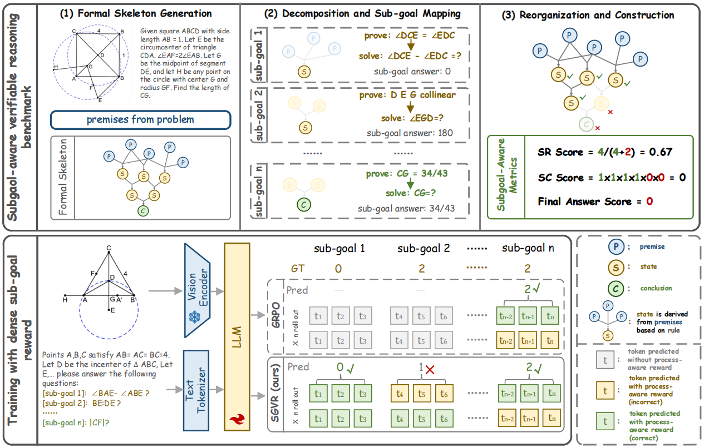

# Milestones over Outcome: Unlocking Geometric Reasoning with Sub-Goal Verifiable Reward

This is the official repository for the paper "Milestones over Outcome: Unlocking Geometric Reasoning with Sub-Goal Verifiable Reward".

## Overview

Multimodal Large Language Models (MLLMs) struggle with complex geometric reasoning tasks, largely because outcome-based "black box" supervision fails to distinguish between lucky guesses and rigorous deduction. To address this, we introduce a paradigm shift towards subgoal-level evaluation and learning.

### Key Contributions

1. **GeoGoal Benchmark**: The first multimodal geometry benchmark where intermediate sub-goals are formally verified and automatically checkable, introducing Skeleton Rate (SR), Skeleton Completion (SC) and Consistency Ratio (CR) as rigorous metrics for reasoning fidelity.

2. **SGVR Framework**: A reinforcement learning framework that leverages verifiable numeric sub-goals as critical reasoning milestones to provide dense supervision.

3. **Empirical Efficacy**: Experiments demonstrate that our proposed SGVR framework improves both final answer accuracy and intermediate reasoning quality, with strong cross-domain transfer to general reasoning tasks.

## Code and Data

**Code and datasets will be released within one month.**

## License

This project is licensed under the MIT License. See the [LICENSE](LICENSE) file for details.

